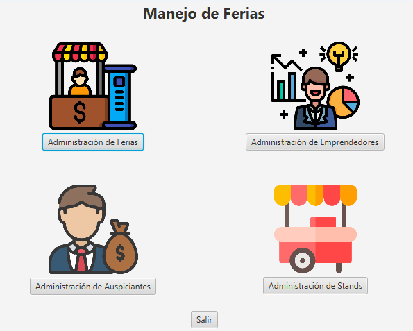

<h1 style="text-align:center">Soy Steve Robinson</h1>

Estudiante de Ciencias de Computación

## Contenido

- [Sobre mí](#sobre-mí)
- [Proyectos](#proyectos)
- [Habilidades](#habilidades)
- [Contacto](#contacto)

## Sobre mí

Estoy estudiando Ingeniería de Computación en la Escuela Superior Politécnica del Litoral. Apasionado por la tecnología, principalmente la inteligencia artificial, siempre busco oportunidades para aprender y crecer tanto personal como profesionalmente. Soy una persona comprometida y responsable, que siempre doy lo mejor de mi en todas las cosas que hago.

-
-
-
-

## Proyectos

| Proyecto    | Descripción | Colaboradores | Imagen |
| -------- | ------- | -------- | ------- |
| [Administrador de Ferias](https://github.com/stikrobinson/POO-P3-G10)  |  Programa de escritorio con interfaz gráfica que se encarga de la administración de stands dentro de una feria.   | [Jefferson Saltos](https://github.com/rsaltos04) [Carlos Ronquillo](https://github.com/carrbrus)   |    |
| [Sistema para Comercialización de Vehículos](https://github.com/stikrobinson/Proyecto_Grupo_12) | Programa de escritorio con interfaz gráfica que se encarga de gestionar la venta y compra de vehículos entre usuarios.    | [Alex Otero](https://github.com/alexoterol) [Sebastián Manzanilla](https://github.com/ManzanillaSebastian) |     |
| [Juego de 20 preguntas](https://github.com/stikrobinson/Proyecto_Grupo_12) | Programa de escritorio con interfaz gráfica que adivina el animal que piensa el usuario con base a preguntas hechas por el programa.     | [Alex Otero](https://github.com/alexoterol) [Sebastián Manzanilla](https://github.com/ManzanillaSebastian) |     |

## Tecnologías

- [Lista de tus habilidades técnicas y personales]

## Contacto

- Correo electrónico: [Tu correo electrónico]
- LinkedIn: [Tu perfil de LinkedIn]
- GitHub: [Tu perfil de GitHub]
